# CPS 491 - Capstone II (Team 02)

_Representative images are from the Spring 2023 - HTML Debugger project done in collaboration with Dayton Regional STEM School._

_Student members include:_

- _Abdulazez Almasoud_
- _Anneliese Friedlander_
- _Christopher Brown_
- _Elijah Crawford_
- _Hunter Buckingham_
- _Joshua Masters_
- _Luis Rodriguez_
- _Luke Hobbs_
- _Nicole Pyke_
- _Riley Hopkins_
- _Samuel Reynolds_

## Table of Contents

1. [Involved Parties](#parties-involved) 
    1. [CPS Department](#cps-department-information)
    2. [Student Team Members](#team-members)
    3. [Client Information](#client-information)
2. [Project Description](#project-financial-exchange)
   1. [Project Overview](#project-overview)
   2. [Context and Scope](#project-context-and-scope)
3. [System Analysis](#system-analysis)
   1. [Requirements](#requirements)
      1. [High-level Requirements](#1-user-account-management)
      2. [Low-level Requirements](#2-order-management)
      3. [Administrative Functions](#3-administrative-functions)
      4. [Low Level Requirements](#4-low-level-requirements)
   2. [Project Diagrams](#diagrams)
      1. [Architecture Diagram](#architecture-diagram)
         1. [Client Side](#client-side)
         2. [Server Side](#server-side)
      2. [Use Case Diagrams](#use-case-diagrams)
      3. [Use Case Description](#use-case-descriptions)
      4. [Sequence Diagrams](#sequence-diagrams)
4. [Technologies](#technology)
   1. [Implementation](#implementation)
      1. [React](#react)
      2. [Node.js](#nodejs)
      3. [Spring Boot](#spring-boot)
      4. [Kafka](#kafka)
      5. [Java](#java)
      6. [MongoDB (Database)](#mongodb-database)
   2. [Design](#design)
      1. [Event Sourcing](#event-sourcing-architectural-pattern)
      2. [CQRS (Architectural Pattern)](#cqrs-architectural-pattern)
      3. [Figma](#figma)
      4. [Bootstrap](#bootstrap)
      5. [Adobe Illustrator](#adobe-illustrator)
      6. [SASS](#sass)
   3. [Documentation](#documentation)
      1. [PlantUml](#plantuml)
      2. [Draw.io](#drawio)
      3. [Markdown](#markdown)
   3. [Data Design](#database-design) 
5. [Project Management](#project-management)
   1. [Planned Sprint cycles](#planned-sprint-cycle-tasks)
   2. [Team Meeting Schedule](#team-meeting-schedule)
   3. [Project Timeline](#project-timeline)
      1. [Jira](#jira)
7. [User Guide/Demo](#user-guidedemo)
8. [Link to Internal Knowledge Base](#knowledge-base)
9. [Link to Glossary](#glossary)

# Parties Involved

This project is a joint project between the CPS Department of the University of Dayton and our esteemed client [Mike Blum](#client-info), focusing on the development of an intuitive platform for stock exchange.

## CPS Department Information

University of Dayton

[Department of Computer Science](https://udayton.edu/artssciences/academics/computerscience/index.php)

CPS 491 - Spring 2024

- Dr. Nick Stiffler (2022 - Present)
- Dr. Phu Phung (2018 - 2021)

## Team members

1. Frontend Developers: 

   - Anneliese Friedlander, blevinsa3@udayton.edu
   - Riley Hopkins, hopkinsa9@udayton.edu
   - Christopher Brown, cbrown6@udayton.edu
   - Hunter Buckingham, buckinghamh1@udayton.edu

2. Backend Developers:

   - Luke Hobbs, hobbsl4@udayton.edu
   - Elijah Crawford, crawforde9@udayton.edu
   - Samuel Reynolds, reynoldss12@udayton.edu
   - Nicole Pyke, pyken1@udayton.edu

3. Documentors: 

   - Abdulazez Almasoud, almasouda2@udayton.edu
   - Joshua Masters, mastersj5@udayton.edu
   - Luis Rodriguez, rodriguezl10@udayton.edu

## Client Information

**Name:** Mike Blum

**University**: University of Dayton (Alumnus)

**Degree**: Bachelor of Science in Computer Science

**Graduation Years**: 1986 - 1990

**Professional Experience:**

   - Former Chief Technology Officer at [KCG Holdings](https://www.kcgholdings.com/)
   - Former Chief Technology Officer at [Goldman Sachs](https://www.goldmansachs.com/)
   - Former Chief Technology Officer at [PharmaCann](https://www.pharmacann.com/)
   - Former Chief Technology Officer at [Epoch Capital](https://epoch.capital/)

# Project: Financial Exchange

With the help of our Client we aim to create a Financial Exchange Web-app named Iceberg with its goal to act similarly to [Robinhood](https://robinhood.com/us/en/). We aim to make it a system where anyone can invest and trade stocks safely.

[Link to Public Github Page](https://financial-exchange.github.io/) 

## Project Overview

Iceberg is a Financial Exchange platform that allows users to create an account, place bids and offers, and view their order history and status. The Iceberg monolith consists of seven microservices which consists of a front-end website, a Start of Day Data Loader, a Client Port, an Event Sequencer, a Matching Engine, an Event Logger, and a Database Writer.

## Project Context and Scope

The goal of the project is to create a simple stock trading interface, similar to that of Robinhood. Features in the initial draft of the project include: registering as a user, viewing stocks on the market, creating and canceling orders, viewing their current positions, and viewing their order history and status. This will be accomplished via communication between the website and a Client Port. This Client Port will then send private commands to a sequencer which will generate public events for the rest of the Iceberg monolith. The information in the events will be used to update the system in various aspects, including but not limited to: updating user positions, updating an order book, and updating user account information.

#### Client Side

- On the client side: The website is serving as the frontend interface for users. This is where users are able to interact with the system, which incudes submitting orders and viewing positions. The user interface is built using React.

#### Server Side

- The server side contains several microservices that process commands and events within the system. 

   - **Exchange Client Port:** Acting as a gateway between the website and the rest of the monolith. Translating request bodies from the website to commands for the exchange. Additionally, the client exchange provides the website with real time data from the aggregate database.

   - **Event Stream Sequencer:** Receives commands and generates corresponding events, assigning unique identifiers in the process. For order commands it will perform the necessary validation for them. 

   - **Matching Engine:** Acting as the core component that matches buy and sell orders in a trading system. It is critical for exchange, ensuring that trades are executed according to the rules of the market.

   - **Database Writer:** Reads from the event stream and updates the aggregate database with the current data.

   - **Event Logger:** Reads from the event stream and logs events as they occur to a human readable text file.

# System Analysis

## Requirements

### 1. User Account Management: 
- <strong>User Registration: </strong> The system provides a registration form where users can create a new account by providing a name, username and a password.

- <strong>Authentication: </strong> Users are able to securely access the system by logging into the website by providing their username and password.

- <strong>Modify Account: </strong> Users are able to modify their account details by providing the system new information. A user is able to change their Name, MPID (Market Participant Identifier), and their password.

### 2. Order Management: 

- <strong>Order Placement: </strong> Users are able to place bids and offers for stocks available on the system. These orders can either be limit orders or market orders.

- <strong>Order Status: </strong> Users are able to view the status for their orders. The status can accepted, completed, rejected, or cancelled.

- <strong>Order Cancellation: </strong> Users are able to cancel any orders that have the "accepted" status. Once an order is cancelled it will be removed from the book.

- <strong>Order History: </strong> Users are able to view all of their previously created orders.

### 3. Administrative functions:

- <strong>Aggregate Data: </strong> Administrators are able to view and search the aggregate data of the system. This data includes Users, User & Firm Risk, Positions, Firms, Orders, and Stocks.

### 4. Low-level Requirements

- <strong>Matching Engine: </strong> A matching algorithm will allow bids and offers to be matched together and create executions. These executions will update the positions for those users.

- <strong>Configuration Data: </strong> The system will create system information, tradable product information, and client information at the start of each market day.

- <strong>Event Logging: </strong> The system will log all generated events to a human readable file.

## Diagrams

The following diagrams reflects the design architecture for the application.

### Architecture Diagram

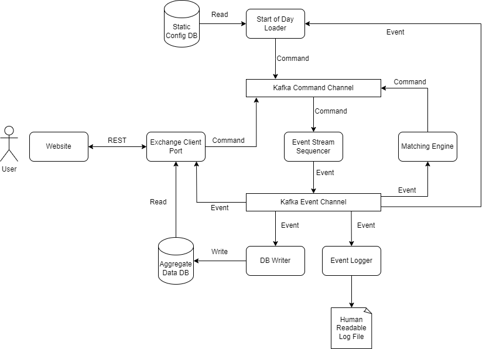

Our project will have the standard 3-Layer architecture, which consists of a <strong>Client side, Server side,</strong>  and <strong> Database. </strong>

- **Exchange Client Port:**

   - Acting as a gateway between the website and the rest of the monolith.
   - It translates request bodies from the website to commands for the rest of the exchange.
   - Additionally, the client exchange provides the website with real-time data from the aggregate database.
   
- **Event Stream Sequencer:**

   - Receives commands and generates the corresponding events, assigning unique identifiers in the process.
   - It will also perform validation on order commands, which will determine if they are rejected or accepted.

- **Matching Engine:**

   - Responsible for matching bids and offers on a given stock.
   - When orders are matched, execution commands are generated which will update the positions of the users that initially created the orders.

- **Database Writer:**

   - Reads from the event stream and updates the aggregate database with the current data.

- **Event Logger:**

   - Reads from the event stream and logs events as they occur to a human-readable text file.

**More information can be found in each microservice's respective repository**

### Use Case Diagrams

Unregistered User  

Registered User  

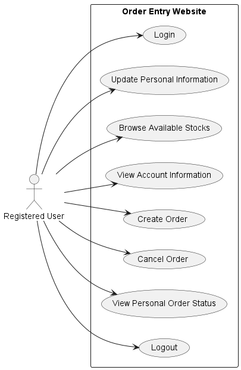

Admin User  

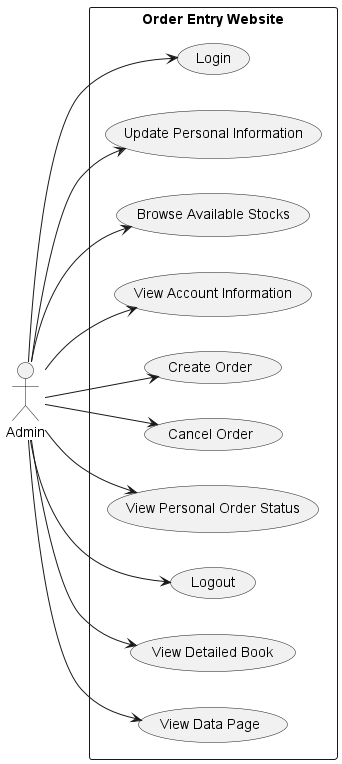

#### Use Case Descriptions 

<!--Login-->

| Use Case name:      |  Login                                                                                                       |
| ------------------- | --------------------------------------------------------------------------------------------------------------------------- |
| Scenario:           | Authentication                                                                                                                     |
| Triggering event:   | User attempts to log in by entering a username and password                                                               |
| Brief description:  | This use case describes the process where a user logs into the system by providing their credentials for authentication.   |
| Actors:             | User                                                                                                                      |
| Preconditions:      | The user must be registered with a username and password in the system.                                                   |
| Postconditions:     | The user is either authenticated and logged into the system, or an error message is displayed.                            |
| Flow of activities: | Actor: 1) User provides username and password. 2) System validates inputs. 1.1) System queries database for credentials. 2.1) System handles input validation failure and displays error. 2.2) System handles successful login and issues a token. |
| Exceptions:         | 2.1) If input validation fails, display error. 2.1) If credentials do not match, display error. 

<!--Logout-->

| Use Case name:      |  Logout                                                                                                               |
| ------------------- | -------------------------------------------------------------------------------------------------------------------------- |
| Scenario:           | Logout                                                                                                                    |
| Triggering event:   | User initiates a logout action                                                                                             |
| Brief description:  | This use case describes the process where a user logs out of the system by ending their session and clearing local storage. |
| Actors:             | User                                                                                                                      |
| Preconditions:      | The user must be logged into the system with a valid session.                                                             |
| Postconditions:     | The user's session is terminated, and the authentication token is removed from local storage.                             |
| Flow of activities: | Actor: 1) User requests to logout. 2) System processes logout request. 2.1) System destroys the session and removes the authentication token from local storage. |
| Exceptions:         | None.                                                                                                                     |

<!--Register-->

| Use Case name:      | User Registration                                                                                                         |
| ------------------- | ------------------------------------------------------------------------------------------------------------------------- |
| Scenario:           | Registration                                                                                                              |
| Triggering event:   | User submits a registration form                                                                                          |
| Brief description:  | This use case describes the process where a new user registers in the system by providing their personal information.      |
| Actors:             | User                                                                                                                      |
| Preconditions:      | The user is not already registered and is accessing the registration form.                                                |
| Postconditions:     | The user is registered in the system with a new account or informed of any errors during the process.                     |
| Flow of activities: | Actor: 1) User submits registration form with username, name, and password. 2) System validates the input. 1.1) System checks if the username exists in the database. 2.1) System handles input validation failure and displays an error. 2.2) System proceeds with registration, generates user ID, and sets up user profile and risk management details. 2.3) System confirms registration completion and displays the home screen to the user. |
| Exceptions:         | 2.1) If the username already exists, display error. 2.1) If input validation fails (e.g., passwords do not match), display error. |

<!--UpdateUser-->

| Use Case name:      | Update User Profile                                                                                                       |
| ------------------- | -------------------------------------------------------------------------------------------------------------------------- |
| Scenario:           | User profile update                                                                                                       |
| Triggering event:   | User submits an update form with new or modified information                                                              |
| Brief description:  | This use case describes the process where an existing user updates their profile details such as name, MPID, or password.  |
| Actors:             | User                                                                                                                      |
| Preconditions:      | The user must be logged into the system and must access the profile update form.                                          |
| Postconditions:     | The user's profile information is updated in the system database, or an error is displayed if the update fails.           |
| Flow of activities: | Actor: 1) User submits the update form. 2) System validates the input. 1.1) System retrieves existing user details from the database. 2.1) System handles input validation failure and displays an error. 2.2) System updates user details and confirms the update. 2.3) System displays the home screen. |
| Exceptions:         | 2.1) If the input validation fails, display an error.                                                                     |

<!--View Order Status Page (As a User)-->

| Use Case name:      | View Order Status (User)                                     |
| ------------------- | ------------------------------------------------------------ |
| Scenario:           | User views their order status                                |
| Triggering event:   | User navigates to and selects the option to view order status |
| Brief description:  | This use case describes how a registered user accesses and views the status of their orders on the trading platform. |
| Actors:             | Registered User                                              |
| Preconditions:      | User must be logged in and have orders placed.               |
| Postconditions:     | User views the status of their orders.                       |
| Flow of activities: | 1) User requests to view order status. 2) System retrieves user information. 3) System fetches orders related to the user. 4) System displays the orders and their statuses to the user. |
| Exceptions:         | If no orders exist, display a message indicating no orders are available. |

<!--View Order Status Page (As an Admin)-->

| Use Case name:      | View Order Status (Admin)                                    |
| ------------------- | ------------------------------------------------------------ |
| Scenario:           | Admin views order status for all users                       |
| Triggering event:   | Admin navigates to and selects the option to view all order statuses |
| Brief description:  | This use case describes how an admin can view the order statuses of all orders from all users on the platform. |
| Actors:             | Admin                                                        |
| Preconditions:      | Admin must be logged in.                                     |
| Postconditions:     | Admin views the statuses of all orders on the platform.      |
| Flow of activities: | 1) Admin requests to view all order statuses. 2) System fetches all orders. 3) System displays the orders and their statuses to the admin. |
| Exceptions:         | If no orders exist, display a message indicating no orders are available. |

<!--View Book as Admin-->

| Use Case name:      | View Order Book (Admin)                                      |
| ------------------- | ------------------------------------------------------------ |
| Scenario:           | Admin views the detailed order book for a specific stock     |
| Triggering event:   | Admin navigates to and selects the option to view the order book for a specific stock |
| Brief description:  | This use case details how an admin accesses and views the order book, which includes all buy and sell orders for a specific stock. |
| Actors:             | Admin                                                        |
| Preconditions:      | Admin must be logged in. The stock symbol must be valid.     |
| Postconditions:     | Admin views the detailed order book including buy and sell orders. |
| Flow of activities: | 1) Admin inputs the stock symbol. 2) System fetches the stock details. 3) System compiles and displays the order book for that stock. |
| Exceptions:         | If the stock symbol is invalid, display an error message. If no orders are available for that stock, display a message indicating no orders are available. |

<!--CreateOrder-->

| Use Case name:      | Create Order                                                                                                             |
| ------------------- | ------------------------------------------------------------------------------------------------------------------------- |
| Scenario:           | Order creation                                                                                                           |
| Triggering event:   | User submits an order form with stock symbol, quantity, and price                                                        |
| Brief description:  | This use case outlines the process where a user creates a new order for a financial instrument on a trading platform.     |
| Actors:             | User                                                                                                                     |
| Preconditions:      | The user must be logged into the system and have sufficient permissions and funds to create orders.                      |
| Postconditions:     | The order is either successfully placed in the market or rejected based on validation rules.                             |
| Flow of activities: | Actor: 1) User submits the order details. 2) System validates the order. 1.1) System verifies user and product IDs. 2.1) System handles input validation failure and displays an error. 2.2) System processes the order through various stages (command, event stream sequencer, event channel, matching engine, database writer) and confirms or rejects the order. 2.3) System updates the user interface with the order status. |
| Exceptions:         | 2.1) If input validation fails, display error. 2.1) If the order is rejected by any system component (e.g., due to insufficient funds, mismatched details), display error and reason for rejection. |

<!--CancelOrder-->

| Use Case name:      | Cancel Order                                                                                                             |
| ------------------- | ------------------------------------------------------------------------------------------------------------------------- |
| Scenario:           | Order cancellation                                                                                                       |
| Triggering event:   | User submits a cancellation request for an existing order                                                                |
| Brief description:  | This use case describes the process where a user requests to cancel an existing order through the trading platform.       |
| Actors:             | User                                                                                                                     |
| Preconditions:      | The user must be logged into the system and must have an existing order that can be cancelled.                           |
| Postconditions:     | The order is either successfully cancelled or an error is displayed if the cancellation is not possible.                 |
| Flow of activities: | Actor: 1) User submits a cancellation request. 2) System processes the cancellation through several stages including server validation, command channel, event stream sequencer, matching engine, and database writer, culminating in the order's cancellation. 2.1) System updates the order status as cancelled. 2.2) System displays the updated order status to the user. |
| Exceptions:         | 2.1) If the order cannot be cancelled (e.g., order already executed or in a non-cancellable state), display error.        |

#### Sequence Diagram(s)

Login

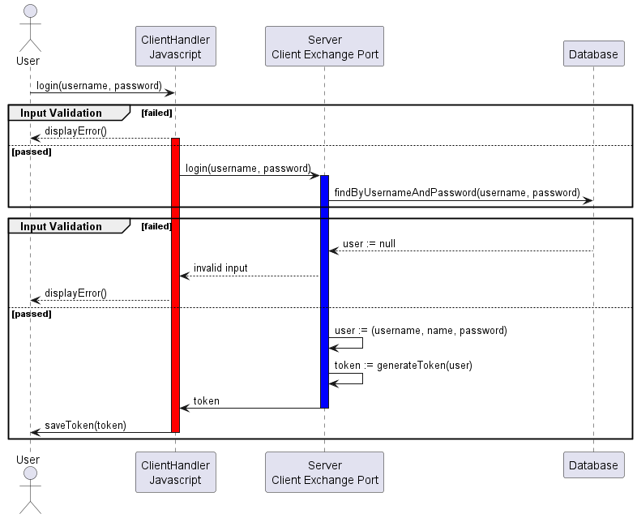                          

Logout

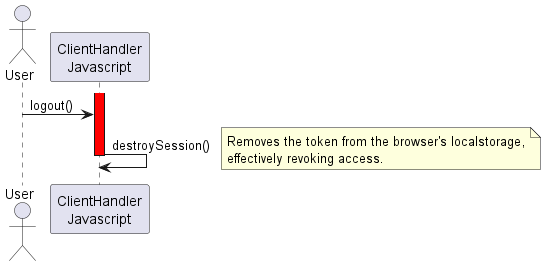

Register

Update User

View Order Status Page (As an Admin)

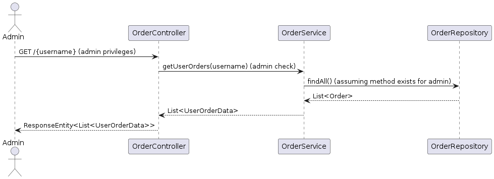

View Order Status Page (As an User)

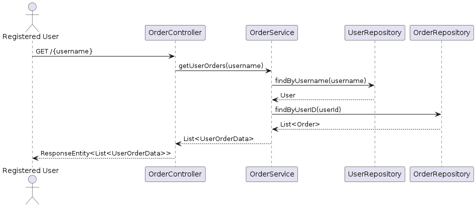

View Book as an Admin

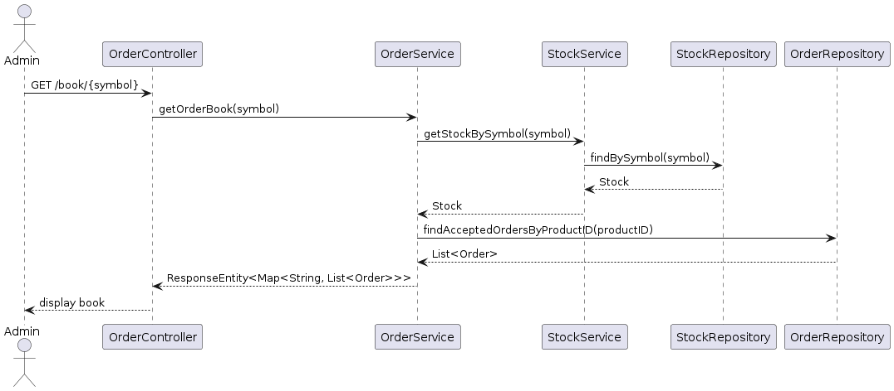

Create Order

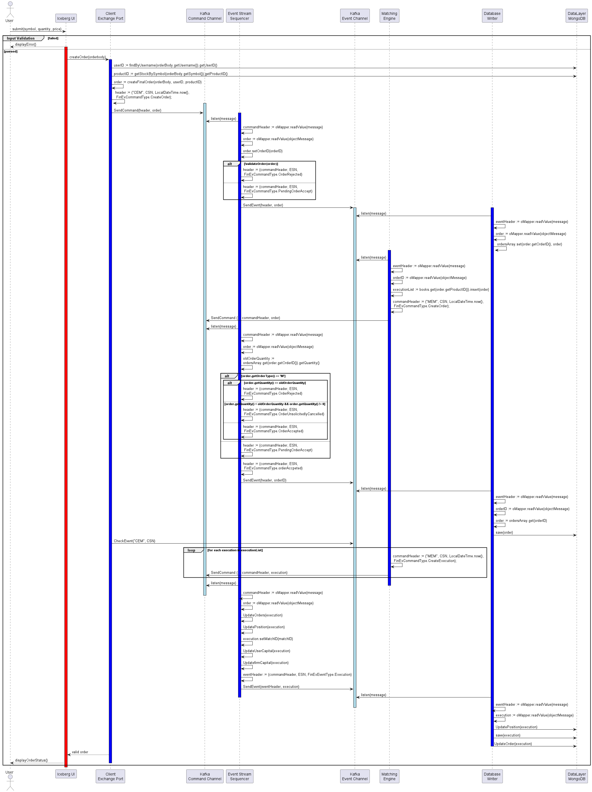

Cancel Order

# Technology 

**Iceberg** integrates frontend and backend technologies with a robust database infrastructure, ensuring a seamless trading experience.

## Implementation 

### React 

React is a widely recognized JavaScript library in developing UI systems, changing the way web applications are built because it offers efficiency and flexibility. It brings a modular way, thus makes way for the ability to develop a dynamic and responsive web application. Its capability to manage the state and props smoothly allows our application to be scalable, easy maintenance, and is key in getting real-time updates important for the display of live stock prices and dynamics of the user portfolio.

### Node.js 

Node.js, is a flexible JavaScript runtime that is very well known for the non-blocking, event-driven architecture that it features. It allows handling multiple simultaneous connections in a very efficient way—a thing that is extremely important for this platform, which requires real-time processing of data. With the vast npm ecosystem, features can be developed at an accelerated rate using Node.js. This is an integrated environment for our application's frontend and backend. It therefore makes for the ideal support to live stock updates, trade executions, instant user notifications and prepares the robust and scalable basis that our platform's complex features demand.

### Spring Boot

Spring Boot is an open-source Java framework used to create a Micro Service. Spring boot is used for programming standalone, production-grade Spring-based applications with minimal effort.

### Kafka

Apache Kafka is an open-source distributed event streaming platform used by thousands of companies for high-performance data pipelines, streaming analytics, data integration, and mission-critical applications. 

### Java 

Java is a widely-used programming language for coding web applications. It has been a popular choice among developers for over two decades, with millions of Java applications in use today. Java is a multi-platform, object-oriented, and network-centric language that can be used as a platform in itself. It is a fast, secure, reliable programming language for coding everything from mobile apps and enterprise software to big data applications and server-side technologies. We chose to use Java due to our team having previous experience working in Java, which in turn reduced the development time.

### MongoDB (Database) 

We chose a MongoDB-based NoSQL database, among other things, owing to its high performance, availability, and scalability. This schemaless feature enables the storage of data in a flexible, adaptable format, basically with the adaptability the trading platform required. This is of great advantage when it comes to the dynamic growth of data structures such as user profiles, stock transactions, and market data. At the same time, with its broad scaling capabilities and superior performance, MongoDB represents a cost-effective platform for serving the large volumes of data our application produces.

## Design 

### Event Sourcing (Architectural Pattern) 

Event sourcing enables our system to scale and persistently interaction with complex data. It logs all state changes that occur in the system, facilitating comprehensive data analysis and enabling microservices to replay system states. This design approach ensures an accurate audit trail across our system making it easier to find issues in the system. The approach also empowers system wide state rewinding, which is useful in case of a system malfunction.

### CQRS (Architectural Pattern) 

Command and Query Responsibility Segregation (CQRS) separates the read from the write operations in our application, optimally implement performance and scalability. The division allows one to develop specifically tailored models for read and write operations separately, which speeds up and enhances the insertion and updating process. CQRS is especially suitable for our trading platform needs, as it is powerful for managing a large quantity of database requests.

### Figma

Figma design is for people to create, share, and test designs for websites, mobile apps, and other digital products and experiences. It is a popular tool for designers, product managers, writers and developers and helps anyone involved in the design process contribute, give feedback, and make better decisions, faster.

### Bootstrap

Bootstrap is a free and open-source CSS framework directed at responsive, mobile-first front-end web development. It contains HTML, CSS and JavaScript-based design templates for typography, forms, buttons, navigation, and other interface components.

### Adobe Illustrator

Adobe Illustrator is a vector graphics editor by Adobe Inc., used for creating scalable illustrations, logos, and graphics. It offers precise drawing tools and integrates well with other Adobe applications, making it a favorite among designers.

### SASS

Sass is a stylesheet language that’s compiled to CSS. It allows you to use variables, nested rules, mixins, functions, and more, all with a fully CSS-compatible syntax. Sass helps keep large stylesheets well-organized and makes it easy to share design within and across projects.

## Documentation

### PlantUml

It is a versatile component that enables swift and straightforward diagram creation. Users can draft a variety of diagrams using a simple and intuitive language

### Draw.io 

It is free online diagram software for making flowcharts, process diagrams, org charts, UML, ER and network diagrams.

### Markdown

Markdown is a lightweight markup language that you can use to add formatting elements to plaintext text documents. 

## Database Design 
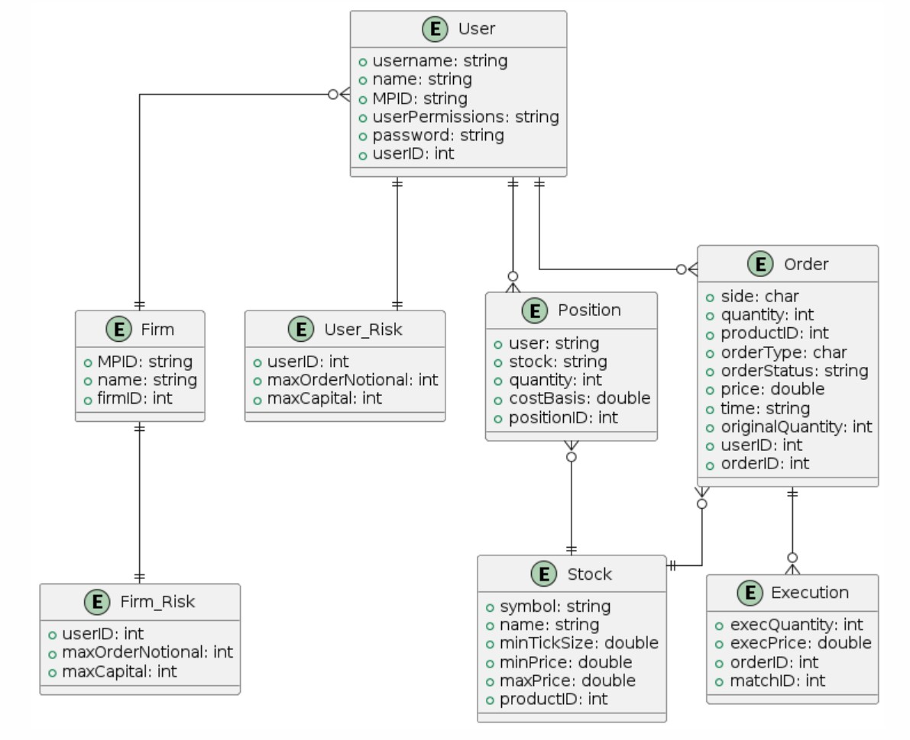

# Project Management 

## Planned sprint cycle tasks 

- Sprint 0 (Jan 08 - Jan 29)
- Sprint 1 (Jan 29 - Feb 04)
- Sprint 2 (Feb 05 - Feb 26)
- Sprint 3 (Feb 27 - Mar 11)
- Sprint 4 (Mar 12 - Apr 05)
- Sprint 5 (Apr 05 - Apr 17)

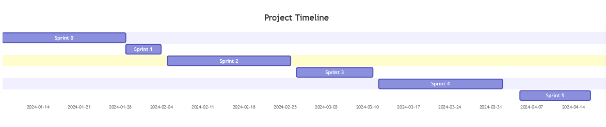
## Team meeting schedule 

Team-only Meetings:

- 3:30pm - 5:00pm Monday
- 3:30pm - 5:00pm Wednesday

Weekly check-in with Dr. Stiffler

- 5:00pm - 5:20pm on Mondays

<a href= "docs/checkins/check-ins.md"> View documents for Check-ins </a>

Sprints 0 - 5

Duration: 2024/01/08 - 2024/04/22

Overall Contributions:

- **Abdulazez Almasoud**: 

	Took the role of documentation/project manager. At the start I helped make sure we’re synchronized and everyone knows their role and are comfortable with it. Moreover, we reached out to our client and found good meeting times we can rely on throughout the semester. We ended up with Mondays and Wednesdays around 3pm. Additionally, I stayed in touch with the client making sure if any changes/updates occurred the team would be informed of them. Furthermore, I made sure all the deliverables were done and submitted at the right time. When it comes to documentation, I managed to get Josh on my subteam due to the size of the project. Throughout the semester we helped each other with the deliverables, and separated the documentation for the microservices between us. Additionally, I started organizing the main README.md in the documentation Microservices with the help of all the subteams, getting their feedback on them and occasionally having to do the changes, so that the document would satisfy their work. Finally we thought that adding Luis to our team would be beneficial, because he can help create the guides and go over the grammar checks

- **Christopher Brown**: 

   Through the first several sprints, provided support in determining and establishing processes to keep the project flowing smoothly. Configured GitHub to put restrictions on Pull Requests, to ensure code is reviewed by the correct people, and configured Jira to better allow the team to communicate and understand what everyone is working on at a given time. Trained and assisted other developers on React and other core frontend technologies. The last two sprints transitioned into a developer role, implementing many of the features on the front-end. These features included the basic authentication system, role checking, custom views, the book viewer, user profile page, and more. Assisted with pull requests and handled complicated merge conflicts.

- **Hunter Buckingham**: 

   My primary role in this project was to develop the front-end iceberg UI and the backend client exchange portal. I wrote the majority of the REST API endpoints on the client exchange portal that would either GET or POST data to our backend kafka stream. I then would follow these endpoints up to the UI where I created the buy/sell pages, user order data, stock details page, and the logout functionality. I also provided the framework for login/registration. Also, I assisted other developers with creating various components and styling as well as assisted in merging branches. 

- **Elijah Crawford**: 

   I helped a lot with developing the initial mockups of the Start of day loader and Event Stream Sequencer. This included getting the initial JSON serialization working and mocking up the initial example JSON. I explored ways of syncing the JSONS across the system using JSON submodules but they were ultimately cut due to minor discrepancies in the submodules. I documented and refactored a large portion of the event stream sequencer and start of day loader and was able to create javadocs from the comments. Additionally, on the event stream sequencer I created the initial data validation and order rejection functionality. Me and Sam researched byte array serialization and implemented it into the project. For Serialization I worked on all of the microservices but played a smaller role on the client exchange port and event stream sequencer. 

- **Anneliese Friedlander**: 

   I led the visual design process for frontend development, designing pages for logging in, registering, viewing stock information, buying and selling, and the landing page. In doing this, I utilized a structured design process by beginning with hand drawn designs and/or Illustrator designs, then transferring them to Figma, and creating multiple iterations. I sought extensive feedback from team members in order to ensure a universal understanding of design decisions. Communication was maintained throughout the design process between the sub-teams. I also provided resources to the team about color theory and the principles of art to help them provide more informed feedback for the web page designs. 

- **Luke Hobbs**: 

   I set up and helped others set up Kafka on the confluent cloud, locally, and on Spring Boot. Designed and implemented a Kafka “Hello World” example using the confluent cloud and on a locally run Kafka server. I had a major role in designing and implementing the Start of Day Loader, Event Stream Sequencer, Matching Engine, Database Warehouse and the Event Logger. I had a major role in redesigning the commands and events to utilize headers and unique object ID’s at the request of our client. I, along with Nicole, designed, implemented, and tested the Matching Engine algorithm. I also had a major role in getting aggregate data calculated and uploaded to MongoDB. I also had minor contributions to the Client Exchange Port and to Order validation. I also did the documentation and sequence diagrams for the Start of Day Loader, Event Stream Sequencer, Event Logger, and Data Warehouse. On top of that, I made major corrections to the Matching Engine and Main Documentation READMEs.

- **Riley Hopkins**: 

   I primarily worked on the front-end team implementing our UI prototypes from Figma, as well as the public webpage explaining the project. I also aided in brainstorming branding and a few of the prototypes as well including the navbar and stock details page. I worked with SCSS and React for the most part, and I developed my own workflow for transferring designs from Figma into implementation as accurately as possible.

- **Joshua Masters**: 

   I served as a primary documenter for the Capstone Financial Exchange Project, working alongside Aziz and Luis to develop comprehensive guides outlining microservice functionality. My focus was on improving project understanding for both developers and end-users. I created a mid-project catch-up guide to assist with getting team members up to speed and running the project locally. I assisted with getting Luis setup with the VSCode environment so that code and documentation could be more easily accessed for his QA, User Guide, and Error Scenario documentation work. Alongside Aziz, I diligently documented vital system processes and microservices. Once initial structures of documentation were created, feedback from both frontend and backend teams assisted tremendously with improving the accuracy of the specifics within documentation across all repositories and microservices. This detailed documentation aided in seamless developer onboarding and facilitated a more efficient development workflow. 

- **Nicole Pyke**: 

   Developed a matching engine to match bids and offers in price time order by creating book objects to hold bids and offers and designing an algorithm matching buy and sell orders that generates executions when orders are inserted on the book. Designed database schema, created object models, and added fields to models as needed throughout the development process for the frontend team to be able to easily access data. Implemented commands and events that were used to communicate between different microservices, reworking secondary events to only send objectIDs instead of the entire object as desired by our client for efficiency. Created static configuration data to be loaded in from the Start of Day Loader. Implemented objectIDs on the Event Stream Sequencer to uniquely identify objects and validated orders against user and firm risk while keeping track of a user and firm’s capital. Created an overview diagram for the system architecture, an entity relationship diagram, and system sequence diagrams for use cases centered around the backend microservices.

- **Samuel Reynolds**: 

   I played a major role in developing the Start of Day Loader and Event Stream Sequencer and a minor role in the Matching Engine, Database Warehouse, and Event Logger microservices. Researched and worked with Elijah on serializing data into Byte Arrays instead of JSON for backend microservices communication, with my focus on the Client Exchange Port, Event Stream Sequencer, and Event Logger. Researched, implemented, and documented the Dockerization of all services apart from the Iceberg UI. Created Docker Compose file and adjusted all Dockerized services to run under a single stack with the capability of running a single microservice locally while developing. Provided feedback to frontend on design choices and worked with Luis on testing Iceberg UI, local microservices, and Docker Desktop. I also helped Luke with documentation revision of all backend microservice and READMEs.

- **Luis Rodriguez**: 

   My main role for Project Iceberg was as a documentarian and as the QA. I contributed to creating the user guide, error log, and helped test many of the microservices. I showed up to most meetings, only missing some due to family emergencies and illness. Throughout the semester, I worked with Josh, Aziz, and Sam regarding testing the microservices and assisting in documentation. 

## Project Timeline 

### Jira 

For our timeline management we are using jira to make tasks with tickets and branch out using those tickets. This tool helped keep track of all the microservices throughout all 5 sprints.

[Click to view our Jira organization](https://24s-cps491-team02.atlassian.net/jira/projects?selectedProjectType=software)

# User Guide/Demo 

[**View User Guide Here**](./docs/QA/user_guide.md)

**Click Image Below to View the Final Demo**
[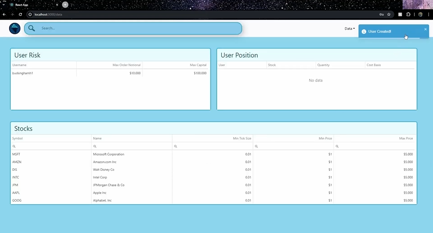](https://youtu.be/7MDNZKwELVc)

[**View other Demos Here**](./docs/demos.md)

# Knowledge Base 

Internal knowledge base for Setup Guides, Descriptions of Microservices, Resource Links and Descriptions of Frontend, Backend, & Documentation Technologies:

<a href= "docs/knowledge_base.md"> **--> View the Knowledge Base <--** </a>

# Glossary

Glossary of terms for users and developers helpful when working with the Iceberg Financial Exchange or reading its docs.

<a href= "docs/glossary.md"> **--> View the Glossary <--** </a>