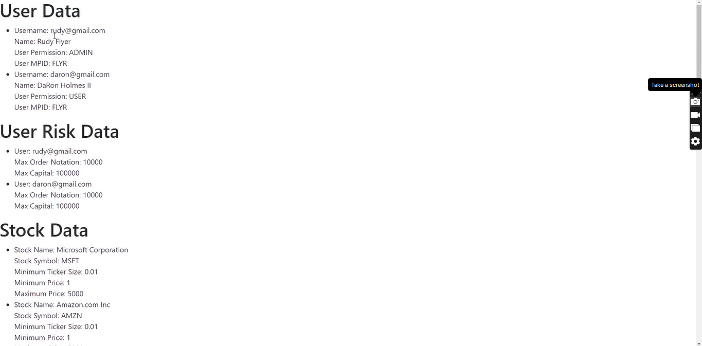
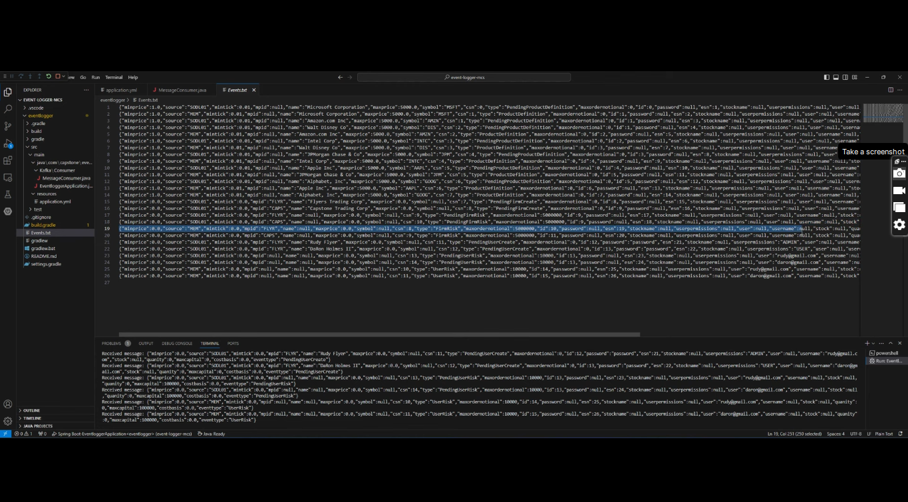
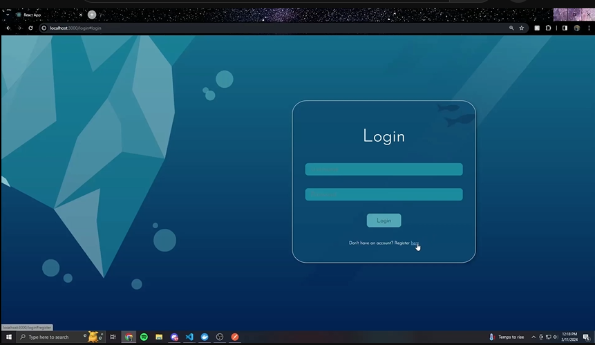
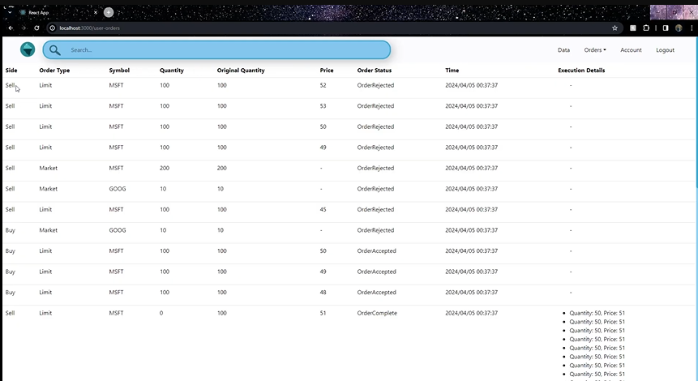

# Demos

## Table of Contents

1. [Sprint 1](#sprint-1)
2. [Sprint 2](#sprint-2)
    1. [Front End](#front-end)
    2. [Back End](#back-end)
3. [Sprint 3](#sprint-3)
4. [Sprint 4](#sprint-4)
5. [Sprint 5](#sprint-5)

## Sprint 1

**There was not demo for sprint 1**

## Sprint 2

_For this sprint front-end and back-end had their own sprints_ 

### Front End

**Click image to view**

### Back End

**Click image to view**

## Sprint 3 

**Click image to view**

## Sprint 4

**Click image to view**

## Sprint 5 (Final Demo)

**Click Image Below to View Sprint 5 Demo**

