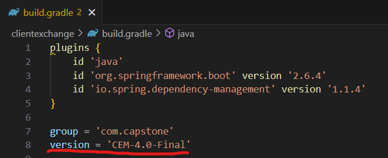
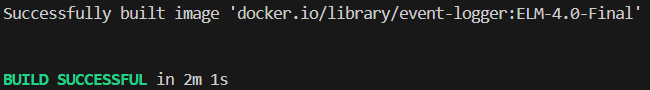
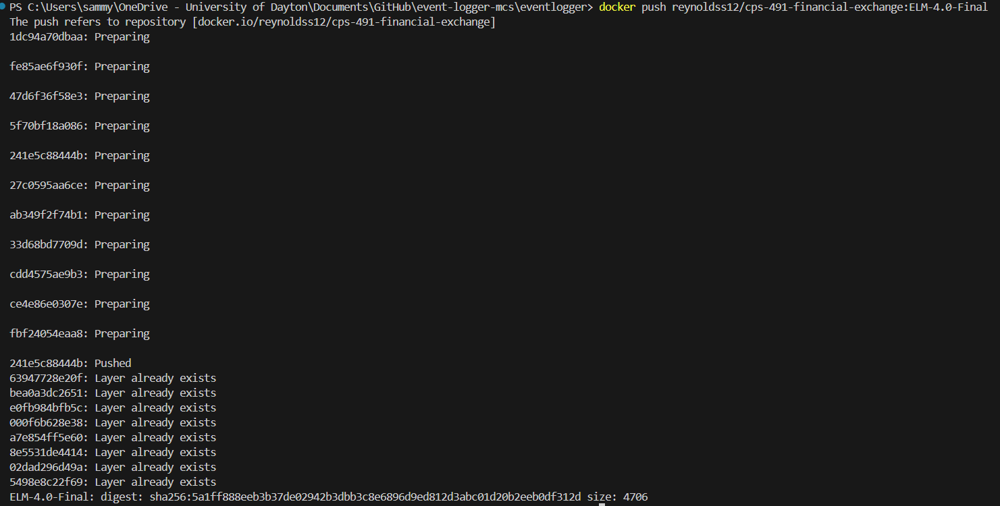
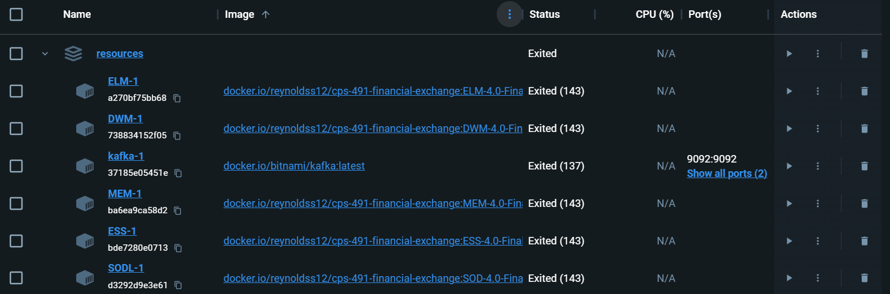

# Dockerization

## Table of Contents
1. [What is Docker](#what-is-docker)
    - [Docker Images](#docker-images)
    - [Docker Compose](#docker-compose)
    - [Docker Hub](#docker-hub)
2. [Creating Images](#creating-images)
    - [Building Images With Springboot](#building-images-with-springboot)
    - [Tagging Images](#tagging-images)
    - [Pushing Images to Docker Hub](#pushing-images-to-docker-hub)
3. [Pulling Images](#pulling-images)
    - [Project Compose File](#project-compose-file)
        - [Changing Microservice Tags](#changing-microservice-tags)
    - [Running Compose](#running-compose)
        - [Running Without Compose](#running-without-compose)

## What is Docker

### Docker Images

- Docker images are containerized applications able to execute code in an independent environment. 

### Docker Compose
- Docker compose is a part of Docker that allows you to use a single file to run multiple Docker images together in a nested environment. See the [project compose file](#project-compose-file) section of this project for a more in depth explanation.


### Docker Hub

- Docker Hub is a platform built into Docker which allows for the hosting of images for others to use. In the scope of this project, we used an existing image of Kafka managed by Bitnami and our pushed images for each microservice so that we could easily pull down and run the images using the compose file shown above.


## Creating Images

- When you are done working on a microservice locally, you can build the service into a docker image to be run as a container. Building and running the container before the microservice runs without bugs will make it harder to debug any issues. 


### Building Images With Springboot
---

Since the project is using Springboot and Gradle, the process of creating images is greatly optimized to create a minimal size container compared to the alternative of using a Docker File. Furthermore, when rebuilding an existing container, the image is split into layers and will only update the layers containing changed code, speeding up build times.

For organizational purposes, before building an image, please update the `version` in the `build.gradle` file for the microservice. This distinguishes clearly between builds and can be used as tags in the next step. This can be something like microservice abbreviation, sprint or section, and the state or ticket name of the branch of the microservice.




| CEM for Client Exchange Microservice, 4.0 for the fourth sprint, Final to designate the final state in the fourth sprint.

After updating the version, open a terminal in the directory containing the `build.gradle` file and run the following command to build the container using Springboot and Gradle:

```./gradlew bootBuildImage```

When this is done running and completes, you should see an output like this:




| Successful build of `Event Logger Microservice` of version `ELM-4.0-Final` in an image named `event-logger:ELM-4.0-Final`

### Tagging Images

---

Once the image is built, the next step is to push it to Docker Hub for others to access. The first process of this is to tag the image for use when pulling back down the built image.

To do this, you must have Docker Desktop open and be logged into your Docker account. Next, run a command similar to the following:

```docker tag [image name] [dockerhub repository]:[tag/version]```

Here is an example of the command being used to tag the event logger seem above:

```docker tag event-logger:ELM-4.0-Final reynoldss12/cps-491-financial-exchange:ELM-4.0-Final```

There should not be any additional output after successfully tagging an image. 

If there is an error, it will most likely be due to no image existing with the input name, not being logged into docker desktop, or not having access to the repo you are trying to tag into.
- Please ask the repository owner for to add your account as a collaborator for you to push to it.


### Pushing Images to Docker Hub

---

The final step is to actually push the image. If you were able to tag the image, it should mean you have access to the repository and all you will need to do is input the following command:

```docker push [dockerhub repository]:[tag/version]```

Here is an example of the command being used with the same tag and repo from before:

```docker push reynoldss12/cps-491-financial-exchange:ELM-4.0-Final```

After successfully running the command, you should see a similar output to the following:




| A successful push of an image skipping existing layers


## Pulling Images
- Setup for pulling images for this project only requires Docker Desktop to be running on your device and for you to be logged into your Docker account.

### Project Compose File

---
Here is the simplified code for the Docker Compose file used in this project:

```
version: "latest"
services:
  kafka:
    image: docker.io/bitnami/kafka:latest
    hostname: kafka
    ports:
      - "9092:9092"
      - ...
    environment:
      - KAFKA_ENABLE_KRAFT=yes
      - ...
  SODL:
    image: docker.io/reynoldss12/cps-491-financial-exchange:SOD-4.0-Final
    hostname: SODL
    environment: 
      - KAFKA_BOOTSTRAP_SERVERS=kafka:9092
  ESS: ...
  ...
  ELM:
    image: ...
    hostname: ELM
    user: root
    environment: 
      - KAFKA_BOOTSTRAP_SERVERS=kafka:9092
      - EVENTS_LOG_DIR=/workspace/EventLogs
    volumes:
    - C:/EventLogs:/workspace/EventLogs
```
Each image is nested underneath services and is passed the parameters nested under them. For the project, we used the:
- `image` to designate where the image is stored in `Docker Hub`
    - For each microservice, you can [change the tag](#changing-microservice-tags) at the end of the image line to pull a specific version of the image down if you know it is pushed into Docker Hub
- `hostname` to set the name of the container when ran
- `ports` to pass open ports into the container for it to communicate on
- `environment` to set environmental variables specific to the Dockerized versions of each microservice
- `user` within the ELM (Event Logger Microservice) to allow it write permissions
- `volumes` to allow a mounted folder to access written logs without the need of entering the container

#### Changing Microservice Tags
If updating all images in the compose or just changing one to test a new version of an image, you can start that image with all the other ones by changing the tag in the compose file. The tag designates what request is made to Docker Hub for what images to pull down. For this project, each microservice is kept separate so that no more than one microservice is pulled down per tag.

- It is important to start microservices together because if they are not under the same folder when ran, there are more complicated networking problems that you would have to address for the microservices to communicate with each other. Alternatively, you can just change the tag in docker compose.

### Running Compose

---

The `compose.yml` is all that is needed to run the microservices once you have Docker Desktop running and are logged in.

In order to run the `compose.yml`, go to the `start-of-day-loader-mcs` repository and open the main branch. Once inside, navigate to the `resource` folder where the `compose.yml` is located by either (assuming you are using VSCODE) right-clicking on the folder and opening an integrated terminal or navigating to the resources with `cd` in a terminal.

Once in the same directory as the `compose.yml`, run the following command to run the compose.yml:

```docker-compose -f compose.yml up```

- If this is your first time running this command, it might take a moment to pull and start the images

Once this is done, you should see the terminal logs of all microservices outputting in the terminal. To stop it, press `ctrl + c` twice.

#### Running Without Compose
After running the `compose up` command once, all the containers will be in your Docker Desktop application. It will look something like this:




| Stopped containers in Docker Desktop

**Additional Notes:**
- In order to start the services again, simply click the play button under the `Actions` column on the `resources` row. 
- To see the complete logs of all services, click the name `resources` under the `Name` column. 
- To see the complete logs of a single microservice, click the name of the corresponding services under `Name` column.
- If still testing a single microservice locally, the fastest way to start all other services is to hit the play button next to resources as in the first note, and then to hit the stop button under the `Actions` column next to the microservice you are working on.
