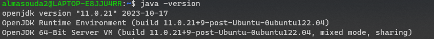
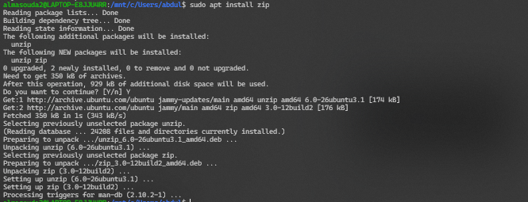
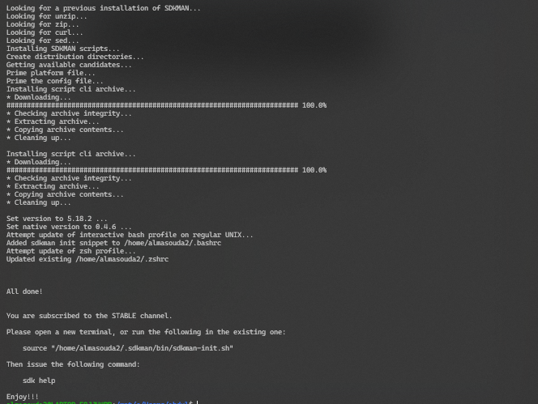

Kafka Java Set Up
========================================================

This is a guide for setting up Kafka with Java designed as a simplified version of the guide that can be found [Kafka Getting Started](https://developer.confluent.io/get-started/java/#introduction). It is recomended to have Windows Subsystem for Linux (wsl) installed for windows users, before starting this guide.


| Table of Contents                                                       |
| ----------------------------------------------------------------------- |
| [1. Install Gradle](#1-install-gradle)                                  |
|   - Checking Java version                                               |
|   - Installing Java (if needed)                                         |
|   - Installing ZIP utilities                                            |
|   - Installing SDKMAN                                                   |
|   - Installing Gradle through SDKMAN                                    |
|                                                                         |
| [2. Create a New Project](#2-create-a-new-project)                      |
|   - Setting up the project directory                                    |
|   - Creating and configuring the `build.gradle` file                    |
|                                                                         |
| [3. Kafka Setup](#3-kafka-set-up)                                        |
|   - Creating an account on Confluent                                    |
|   - Creating a Kafka cluster                                            |
|                                                                         |
| [4. Configuration](#4-configuration)                                    |
|   - Configuring the Kafka client                                        |
|   - Creating and editing `getting-started.properties` file              |
|                                                                         |
| [5. Create a New Topic](#5-create-a-new-topic)                          |
|   - Creating a `purchases` topic in the Kafka cluster                   |
|                                                                         |
| [6. Build Producer](#6-build-producer)                                  |
|   - Setting up the directory structure for the producer                 |
|   - Creating and configuring `ProducerExample.java`                     |
|                                                                         |
| [7. Build Consumer](#7-build-consumer)                                  |
|   - Creating and configuring `ConsumerExample.java`                     |
|                                                                         |
| [8. Produce and Consume Events](#8-produce-and-consume-events)          |
|   - Building the JAR file                                               |
|   - Running the producer and consumer applications                      |


## 1. Install Gradle

Check the current Java version (if installed)

Gradle runs on all major operating systems and requires only a Java JDK version 8 or higher to be installed. 

- To check run the following command 

    - Run:

        `$java -version`
    
    

- If the java was installed, the version must be 11 or higher. If it was below 11, run the following command to install version 11.

    Run: 

    `$sudo apt-get install openjdk-11-jre`

    Then after checking the version, the output should be the following:

    

- Make sure you have zip installed by running the following:
    - Run:

        `$sudo apt-get install unzip`

        `$sudo apt-get install zip`

    

Next install SDKMAN:

- SDKMAN is a tool for managing parallel versions of multiple software development kits on most Unix-based systems!-

    - Run to install SDKMAN:
    
    `$curl -s "https://get.sdkman.io" | bash`

    The end of the output should look like this:

    


- Finally installing Gradle

    - run the following command to install:
    
    `$sdk install gradle 8.5`

    The following would be the output if SDKMAN was not installed before running the previous command

    


## 2. Create a new project  

This step focuses on setting up a new poject in Kafka

The process would be easier if the file structure used in the guide was followed.

- Create the Directory `kafka-java-getting-started` (anywhere, main preferred)

**Note**: there are two ways of creating this directory

1. Manually via the IDE being used
2. Running the following command (while in the direcory chosen)

`$mkdir kafka-java-getting-started`

- Switch to the new directory 

`$cd kafka-java-getting-started`

- Create a Gradle build file `build.gradle` for the project, by running the following

`$touch build.gradle`
       
- Add the following content to build.gradle

**Note**: two ways of editing a file are the following:

1. Editing manually via the IDE used 
2. Running the following command

`$nano build.gradle`

The content to be added to `build.gradle` is:

```Groovy
buildscript {
	repositories {
    	mavenCentral()
	}
	dependencies {
    	classpath "gradle.plugin.com.github.jengelman.gradle.plugins:shadow:7.0.0"
	}
}

plugins {
	id "java"
	id "idea"
	id "eclipse"
}

sourceCompatibility = "1.11"
targetCompatibility = "1.11"
version = "0.0.1"

repositories {
	mavenCentral()

	maven {
    	url "https://packages.confluent.io/maven"
	}
}

apply plugin: "com.github.johnrengelman.shadow"

dependencies {
	implementation group: 'org.slf4j', name: 'slf4j-nop', version: '2.0.3'
	implementation group: 'org.apache.kafka', name: 'kafka-clients', version: '3.3.1'

	// needed if OAuth is used; otherwise this can be left out.
	// See: https://docs.confluent.io/platform/current/kafka/authentication_sasl/authentication_sasl_oauth.html
	implementation group: 'com.fasterxml.jackson.core', name: 'jackson-databind', version: '2.15.2'
}

jar {
	manifest {
    	attributes(
            	"Class-Path": configurations.compileClasspath.collect { it.getName() }.join(" "),
            	"Main-Class": "examples.ProducerExample"
    	)
	}
}

shadowJar {
	archiveBaseName = "kafka-java-getting-started"
	archiveClassifier = ''
}

```
- Exit the file
After editing the content of the file, save it by pressing `ctrl + s` then exit the file by pressing `ctrl + x`


## 3. Kafka Set up

- First create an account in [Confluent](https://www.confluent.io/get-started/)

- Create a cluster as part of creating an account

    -  After creating the cluster it should be under Environments

    

## 4. Configuration

- After opening the cluster do the following:

    1. Cluster overview 
    2. Get started (under set up client)
    3. Choose Java
    4. Copy the configuration snippet for your clients

    **Note: Keep the copy in a separate txt file, it will be used in the following steps**

- While on the firectory `kafka-java-getting-started` create a file named `getting-started.properties`

Run:

`$touch getting-started.properties`

-Edit the file

Run(or from IDE): 

`$nano getting-started.properties`

- For the content of this file, add content copied in the txt file at the start of this section

Before exiting the file, there is four lines that must be added for this program to run

After 

```Java
acks=all
```

Add the following lines 

```Java
key.serializer=org.apache.kafka.common.serialization.StringSerializer
value.serializer=org.apache.kafka.common.serialization.StringSerializer
key.deserializer=org.apache.kafka.common.serialization.StringDeserializer
value.deserializer=org.apache.kafka.common.serialization.StringDeserializer
```

Making this section look like the following:

```Java
# Best practice for Kafka producer to prevent data loss

acks=all
key.serializer=org.apache.kafka.common.serialization.StringSerializer
value.serializer=org.apache.kafka.common.serialization.StringSerializer
key.deserializer=org.apache.kafka.common.serialization.StringDeserializer
value.deserializer=org.apache.kafka.common.serialization.StringDeserializer
```
- Exit the file
After editing the content of the file, save it by pressing `ctrl + s` then exit the file by pressing `ctrl + x`

## 5. Create a New Topic

- While having the Cluster chosen click the Topics tab on the sidebar

    - Make a new cluster named `purchases` with 1 partitions

    

**Note**: It is important to have the exact same topic as shown, and with it being in the cluster made


## 6. Build Producer

- While under the directory `kafka-java-getting-started` create the following directories in that order `src/main/java/examples` 

    - The following command creates all four

        `$mkdir -p src/main/java/examples`

- Change directory to examples

    - If the directory was not set as example, run the following:

        `$cd src/main/java/examples`

- Create a java file in examples named ProducerExample.java

    - Run:

        `$touch ProducerExample.java`

- Add the following content to ProducerExample.java

```Java
package examples;

import org.apache.kafka.clients.producer.*;

import java.io.*;
import java.nio.file.*;
import java.util.*;

public class ProducerExample {

	public static void main(final String[] args) throws IOException {
    	if (args.length != 1) {
        	System.out.println("Please provide the configuration file path as a command line argument");
        	System.exit(1);
    	}

    	// Load producer configuration settings from a local file
    	final Properties props = loadConfig(args[0]);
    	final String topic = "purchases";

    	String[] users = {"eabara", "jsmith", "sgarcia", "jbernard", "htanaka", "awalther"};
    	String[] items = {"book", "alarm clock", "t-shirts", "gift card", "batteries"};
    	try (final Producer<String, String> producer = new KafkaProducer<>(props)) {
        	final Random rnd = new Random();
        	final Long numMessages = 10L;
        	for (Long i = 0L; i < numMessages; i++) {
            	String user = users[rnd.nextInt(users.length)];
            	String item = items[rnd.nextInt(items.length)];

            	producer.send(
                    	new ProducerRecord<>(topic, user, item),
                    	(event, ex) -> {
                        	if (ex != null)
                            	ex.printStackTrace();
                        	else
                            	System.out.printf("Produced event to topic %s: key = %-10s value = %s%n", topic, user, item);
                    	});
        	}
        	System.out.printf("%s events were produced to topic %s%n", numMessages, topic);
    	}

	}

	// We'll reuse this function to load properties from the Consumer as well
	public static Properties loadConfig(final String configFile) throws IOException {
    	if (!Files.exists(Paths.get(configFile))) {
        	throw new IOException(configFile + " not found.");
    	}
    	final Properties cfg = new Properties();
    	try (InputStream inputStream = new FileInputStream(configFile)) {
        	cfg.load(inputStream);
    	}
    	return cfg;
	}
}
```

- Change the directory back to kafka-java-getting-started by running the following (if on examples currently)

`$cd ../../../../`

Run the following command to build the file create in examples:

`$gradle build`

- **BUILD SUCCESSFUL** is the expected output as shown below


    

## 7. Build Consumer

- Change your directory back to `example`, by running the following command (if in kafka-java-getting-started)

`$cd src/main/java/examples`

- Create a java file named ConsumerExample.java

`$touch ConsumerExample.java`

- Add the following content to ConsumerExample.java

```java
package examples;

import org.apache.kafka.clients.consumer.*;

import java.time.Duration;
import java.util.Arrays;
import java.util.Properties;

public class ConsumerExample {

	public static void main(final String[] args) throws Exception {
    	if (args.length != 1) {
        	System.out.println("Please provide the configuration file path as a command line argument");
        	System.exit(1);
    	}

    	final String topic = "purchases";

    	// Load consumer configuration settings from a local file
    	// Reusing the loadConfig method from the ProducerExample class
    	final Properties props = ProducerExample.loadConfig(args[0]);

    	// Add additional properties.
    	props.put(ConsumerConfig.GROUP_ID_CONFIG, "kafka-java-getting-started");
    	props.put(ConsumerConfig.AUTO_OFFSET_RESET_CONFIG, "earliest");

    	try (final Consumer<String, String> consumer = new KafkaConsumer<>(props)) {
        	consumer.subscribe(Arrays.asList(topic));
        	while (true) {
            	ConsumerRecords<String, String> records = consumer.poll(Duration.ofMillis(100));
            	for (ConsumerRecord<String, String> record : records) {
                	String key = record.key();
                	String value = record.value();
                	System.out.println(
                        	String.format("Consumed event from topic %s: key = %-10s value = %s", topic, key, value));
            	}
        	}
    	}
	}

}

```

- Change the directory back to kafka-java-getting-started by running the following (if on examples currently)

`$cd ../../../../`

Run the following command to build the file create in examples:

`$gradle build`

- **BUILD SUCCESSFUL** is the expected output as shown below


    

## 8. Produce Events & Consume Events

- While on kafka-java-getting-started directory run the following command to create a JAR

`$gradle shadowJar`

giving an output similar to the following


- Run the following command to create the produce event (while on `kafka-java-getting-started$`)

    `$java -cp build/libs/kafka-java-getting-started-0.0.1.jar examples.ProducerExample getting-started.properties`

    Output:
```console
Produced event to topic purchases: key = awalther   value = t-shirts
Produced event to topic purchases: key = htanaka	value = t-shirts
Produced event to topic purchases: key = htanaka	value = batteries
Produced event to topic purchases: key = eabara 	value = t-shirts
Produced event to topic purchases: key = htanaka	value = t-shirts
Produced event to topic purchases: key = jsmith 	value = book
Produced event to topic purchases: key = awalther   value = t-shirts
Produced event to topic purchases: key = jsmith 	value = batteries
Produced event to topic purchases: key = jsmith 	value = gift card
Produced event to topic purchases: key = eabara 	value = t-shirts
10 events were produced to topic purchases


```

- Run the following command to create the consume event (while on `kafka-java-getting-started$`)

    `$java -cp build/libs/kafka-java-getting-started-0.0.1.jar examples.ConsumerExample getting-started.properties`


Output:
```console
Consumed event from topic purchases: key = awalther   value = t-shirts
Consumed event from topic purchases: key = htanaka	value = t-shirts
Consumed event from topic purchases: key = htanaka	value = batteries
Consumed event from topic purchases: key = eabara 	value = t-shirts
Consumed event from topic purchases: key = htanaka	value = t-shirts
Consumed event from topic purchases: key = jsmith 	value = book
Consumed event from topic purchases: key = awalther   value = t-shirts
Consumed event from topic purchases: key = jsmith 	value = batteries
Consumed event from topic purchases: key = jsmith 	value = gift card
Consumed event from topic purchases: key = eabara 	value = t-shirts

```

