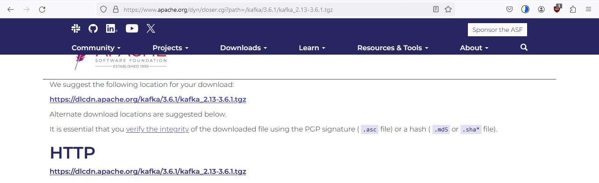
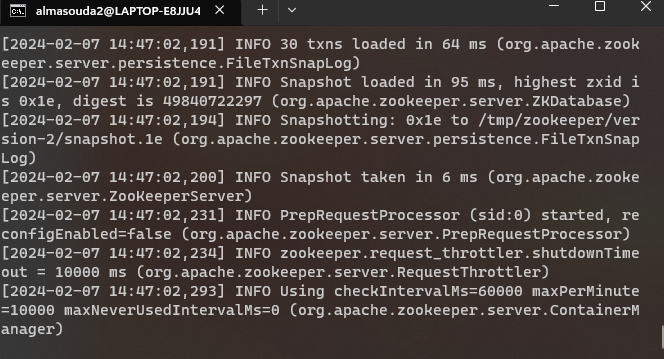
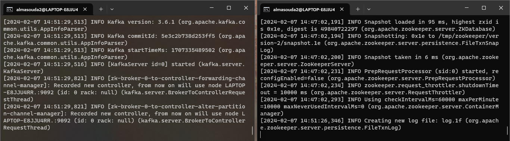
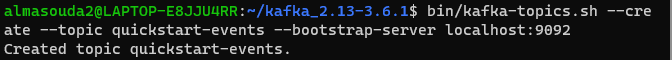
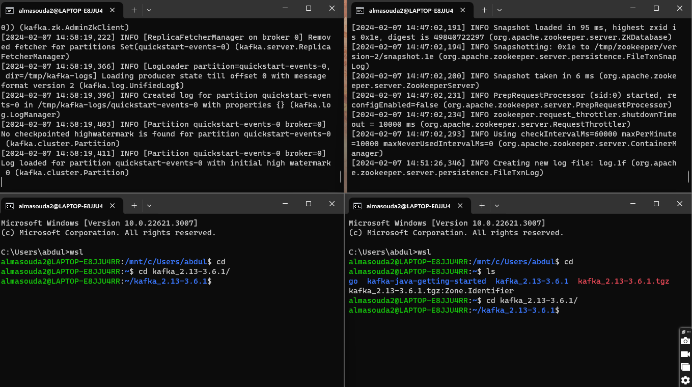
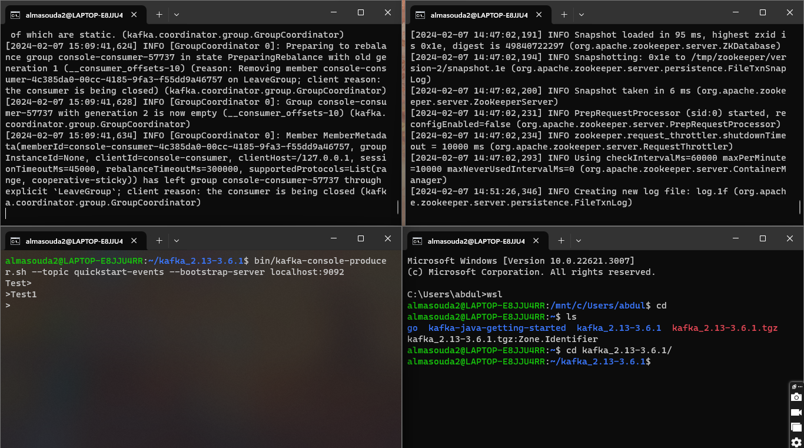
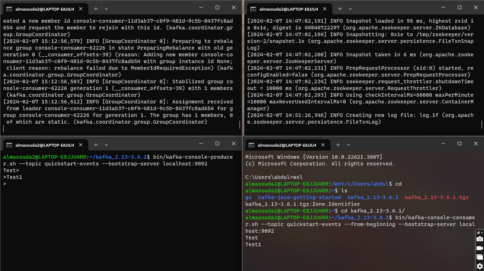
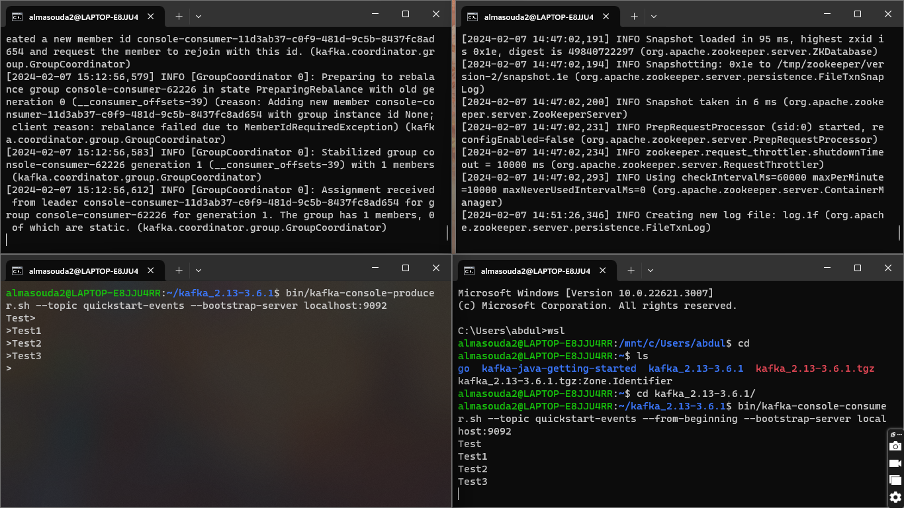

Apache Kafka Quickstart (Locally) 
========================================================

This guide gives an introduction to Apache Kafka, which is a platform that uses real-time data. Moreover, this an introducation guide of running Kafka locally using different terminals, through these examples we will, publish, subscribe to streams of records, store streams, and process those streams simultaneously  

| Table of Contents                                                                          |
| ------------------------------------------------------------------------------------------ |
| [1. Get Kafka](#1-get-kafka)                                                               |
|                                                                                            |
|   - Download the Latest Version of Kafka (HTTP)                                            |
|   - Extract the Zip File for Kafka                                                         |
|   - Directory content                                                                      |
|                                                                                            |
|                                                                                            |
| [2. Start the Kafka Enviroment](#2-start-the-kafka-enviroment)                             |
|                                                                                            |
|   - Checking Java Installation/Version (8+ needed)                                         |
|   - Starting Zookeeper                                                                     | 
|   - Starting Kafka Broker                                                                  |
|                                                                                            |
| [3. Create a Topic to Store Your Events](#3-create-a-topic-to-store-your-events)           |
|                                                                                            |
|   - Command for Creating a Topic                                                           |
|   - Verifing the Topic Creation                                                            |
|                                                                                            |
| [4. Write some events into the topic](#4-write-some-events-into-the-topic)                 |
|                                                                                            |
|                                                                                            |
|   - Setting Up the Terminal for Producer                                                   |
|   - Produce Events                                                                         |
|   - Produced Events Examples                                                               |
|                                                                                            |
|                                                                                            |
| [5. Read the event](#5-read-the-event)                                                     |
|                                                                                            |
|   - Setting Up the Terminal for Consumer                                                   |
|   - Consume Events                                                                         |
|   - Real-time Event Consumtion                                                             |
|                                                                                            |


## 1. Get Kafka
- Get the latest version of [Kafka](https://www.apache.org/dyn/closer.cgi?path=/kafka/3.6.1/kafka_2.13-3.6.1.tgz)

    - Chose HTTP as shown in the following

         

- Move your zip file in the main directory on linux (preffered)

    `\\wsl.localhost\Ubuntu\home\(your user name for wsl)`

- While on the preffered directory Unzip the file with the following commands

    ```console
    tar -xzf kafka_2.13-3.6.1.tgz
    cd kafka_2.13-3.6.1
    ```

- The following is the content of kafka_2.13-3.6.1

     

**Note**: *you can choose any directory, this directory is the preffered using linux*

## 2. Start The Kafka Enviroment

- You must have Java 8+ installed in your local environment

    - Run the following command to check your version 

        ```console
        java -version
        ```
- Apache Kafka can be started using ZooKeeper.
    - Run the following command in order to start all services in the correct order: 
        ```console
        bin/zookeeper-server-start.sh config/zookeeper.properties
        ```
    - Giving the following output

        
    
- Open a second terminal next to the one running zookeeper, 

    - On the second terminal run the following command to start the broker service

        ```console
        bin/kafka-server-start.sh config/server.properties
        ```
        This will provide a basic Kafka enviroment to be used

    - the following is the output for the last command used (the terminal on the left is the one used in this example)

        

**Note**: *do not close both terminals in this step*

## 3. Create a Topic To Store Your Events

Before you make/write your first event you must create a topic to store the events in.

- Open a third terminal for your first topic 

    - Run the following command to create it:

        ```console
        bin/kafka-topics.sh --create --topic quickstart-events --bootstrap-server localhost:9092
        ```

    - Giving this output

        

**Note2**: *You can close the terminal **IN THIS PART**, but keep the other two terminals from part2, becasue they will be used in the following parts*

## 4. Write Some Events Into the Topic

**Important Note**: *for this step you would need 4 terminals on your desktop/window, in addition two from part 2, similar to the following*

### **The bottom left and bottom right are the new ones, top right is for zookeeper top left is for kafka broker** 
- The one on the bottom left will be used for part 4 **(this part)** the one on the top right will be used for part 5 **(the next part)** 



    
- On the bottom left console run the following command to make the producer, and add as many events as you like, such as “Test, Test1, …”

    ```console
    bin/kafka-console-producer.sh --topic quickstart-events --bootstrap-server localhost:9092
    ```

    - Then you add the events manually in your topic

    


## 5. Read The Event

**Note1**: *This part will use the terminal on the bottom right*

- On the bottom right terminal run the following command for the consumer that reads the events made with the produce:

    ```console
    bin/kafka-console-consumer.sh --topic quickstart-events --from-beginning --bootstrap-server localhost:9092
    ```

    - Printing the events from part 4 

    


**Note2**: *You can input new events in the producer terminal and it will update in the consumer terminal.*

- In the following Test2 and Test3 was added in producer, and printed in the consumer.




