Post-Sprint 2 Catch Up Guide (Updated 3/4)
========================================================

| Table of Contents                                                       |
| ----------------------------------------------------------------------- |
| [1. Prerequisites](#1-prerequisites)                                    |
|   - Install Docker                                                      |
|   - Install Gradle                                                      |
|   - Spring Extension (VSCode)                                           |
|   - Clone All Relevant Git Repos                                        |
|                                                                         |
| [2. Backend Kafka](#2-backend-kafka)                                    |
|   - Run Docker in Background                                            |
|   - Start Up Microservices                                              |  
|                                                                         |
| [3. Frontend UI](#3-frontend-ui)                                        |
|   - Change Directories                                                  |             
|   - Start the website locally                                           |
|                                                                         |
|                                                                         |


## 1. Prerequisites

(Guide Designed for VSCode)

### - Install Docker
- Get Docker Install from: [Get Docker](https://docs.docker.com/get-docker/)
    - [Docker Download (Windows)](https://docs.docker.com/desktop/install/windows-install/)
    - [Docker Download (Mac)](https://docs.docker.com/desktop/install/mac-install/)
    - [Docker Download (Linux)](https://docs.docker.com/desktop/install/linux-install/)

### - Install Gradle

Check the current Java version (if installed)

Gradle runs on all major operating systems and requires only a Java JDK version 8 or higher to be installed. 

- To check run the following command 

    - Run:

        `$java -version`
    
    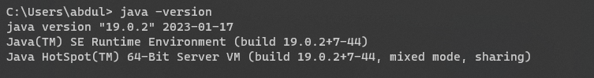

- If the java was installed, the version must be 11 or higher. If it was below 11, run the following command to install version 11.

    Run: 

    `$sudo apt-get install openjdk-11-jre`

    Then after checking the version, the output should be the following:

    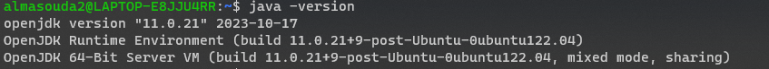

- Make sure you have zip installed by running the following:
    - Run:

        `$sudo apt-get install unzip`

        `$sudo apt-get install zip`

    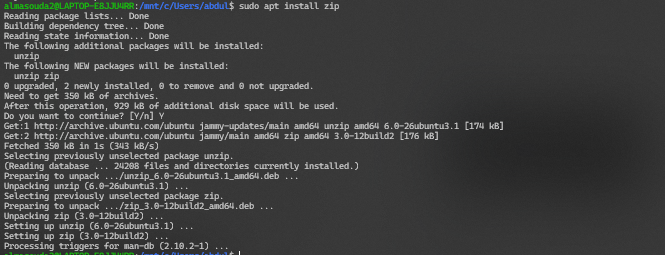

Next install SDKMAN:

- SDKMAN is a tool for managing parallel versions of multiple software development kits on most Unix-based systems!-

    - Run to install SDKMAN:
    
    `$curl -s "https://get.sdkman.io" | bash`

    The end of the output should look like this:

    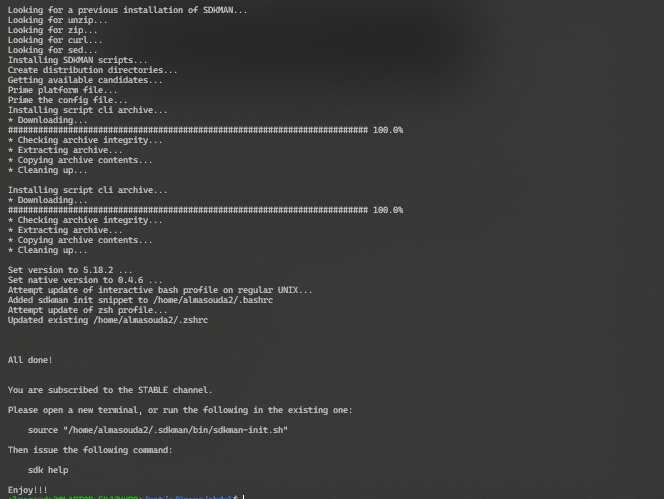


- Finally installing Gradle

    - run the following command to install:
    
    `$sdk install gradle 8.5`

    The following would be the output if SDKMAN was not installed before running the previous command

    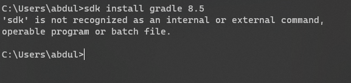

### - Spring Extension (VSCode)  
- In VSCode, click Extensions or `Ctrl+Shift+X` and Search "Spring Boot Extension Pack"
- Install the following and click Continue on prompts if it pulls up the [visual studio website](https://marketplace.visualstudio.com/items?itemName=vmware.vscode-boot-dev-pack) in your browser :

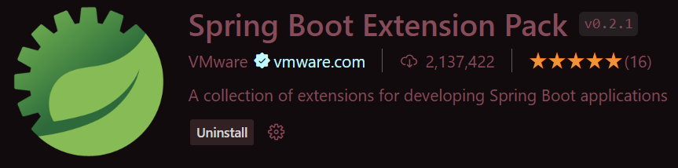

### - Clone Relevant Git Repos
- Clone the following Repos into local directories:
    - ```matching-engine-mcs``` Git Command:```git clone git@github.com:Financial-Exchange/matching-engine-mcs.git```
    - ```data-warehouse-mcs``` Git Command:```git clone git@github.com:Financial-Exchange/data-warehouse-mcs.git```
    - ```start-of-day-loader-mcs``` Git Command:```git clone git@github.com:Financial-Exchange/start-of-day-loader-mcs.git```
    - ```event-logger-mcs``` Git Command:```git clone git@github.com:Financial-Exchange/event-logger-mcs.git```
    - ```iceberg-ui``` Git Command:```git clone git@github.com:Financial-Exchange/iceberg-ui.git```
    
## 2. Backend Kafka

### - Run Docker Desktop in Background

Open Docker, login with relevant account (UD Account works), and allow for running in background

### - Install Docker

Docker Compose (compose.yml) allows for multiple images to run at once

Locate and open compose.yml (~\start-of-day-loader-mcs\src\SOD\src\main\resources\compose.yml) in terminal (right-click compose.yml and clock "Open in Integrated Terminal" on VSCode)

#### Tip: If you are seeing files or entire directories appearing to be highlighted red, Java will need to be reloaded. This can be solved one of two ways:
- 

Run ```docker-compose -f compose.yml up``` to start Docker Kafka (Startup of microservices might take some time initially)

Run ```docker-compose -f compose.yml down``` to stop Docker Kafka (Command to be run in powershell if on Windows)

### Successful Start:
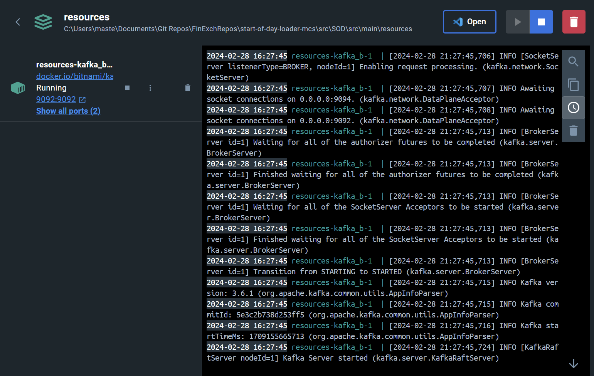

Change localhost in application.yml (also in ~\resources directory) and KafkaProducerConfig.java (localhost:9092)

Send Commands (WIP)
- cd into ~/start-of-day-loader-mcs/src/SOD/
- In application.yml, change 'bootstrap-servers: 172.18.38.128:9092' to 'localhost:9092' for running locally. 
- Run ```./gradlew bootRun``` in terminal to build the Java Project and run the Spring application.
(May need to run ```chmod +x gradlew``` if gradle permissions are denied. This is a Mac-specific issue.)
(ERROR: JAVA_HOME is set to an invalid directory can be resolved by installing JAVA 17 and removing any export commands in your .bashrc file. If further issues arise, may need to install [Java 17](https://www.oracle.com/java/technologies/javase/jdk17-archive-downloads.html) and update your JAVA_HOME in Environment to the new java folder 'jdk-17' and add '%JAVA_HOME%\bin' to Path Environment Variables and click 'Move Up' until it is read first at the top.)

### Successful Commands:
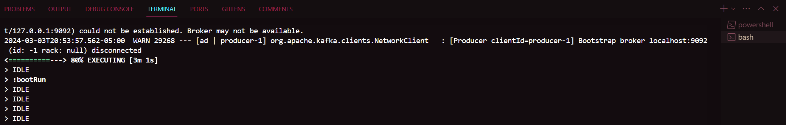
(Should only reach 80% Executing )

## 3. Frontend UI

Client Exchange Microservice with Iceberg-UI Frontend Website

- Clone the following Repo into local directories:
    - ```client-exchange-mcs``` Git Command:```git clone git@github.com:Financial-Exchange/client-exchange-mcs.git```

#### Tip: Open separate VSCode windows for each repo that you are trying to work on at a given time. (Right-click VSCode and click 'Open New Window')

cd ~/client-exchange-mcs/
git checkout CEM-8-Read-aggregate-data

Open separate instance (new window) of VSCode
cd ~/iceberg-ui/
git checkout ICE-5-Create-home-page-after-user-has-been-authenticated 

Using Postman for Restful API Calls

Looking at different controllers in ~\client-exchange-mcs\clientexchange\src\main\java\com\capstone\clientexchange\rest

In Postman:
Create New Collection, rename it to 'Client Exchange', click 'Add a request',  & name it 'get user'.

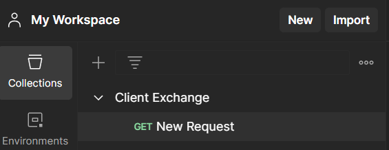  


(Get: localhost:8080/api/user/getUserData/rudy@gmail.com) and Send

Should receive error 401 which means we need to authenticate. 

(Or will receive "Error: connect ECONNREFUSED 127.0.0.1:8080". Which requires you to cd into ~/client-exchange-mcs/client-exchange repo, git checkout CEM-8, and run command ```./gradlew bootRun```.) (Will take a moment for initial run and compilation.)

Add a new request with Client Exchange 3 dots (Click 'Add request') & name it 'Authentication'.

Endpoint /api/auth to produce JWT token 
Post -- localhost:8080/api/auth/token

Go to the following:
Body -> raw -> JSON
send over a username and password
Copy and Paste the following Example:
{
"username": "rudy@gmail.com",
"password": "password"
}

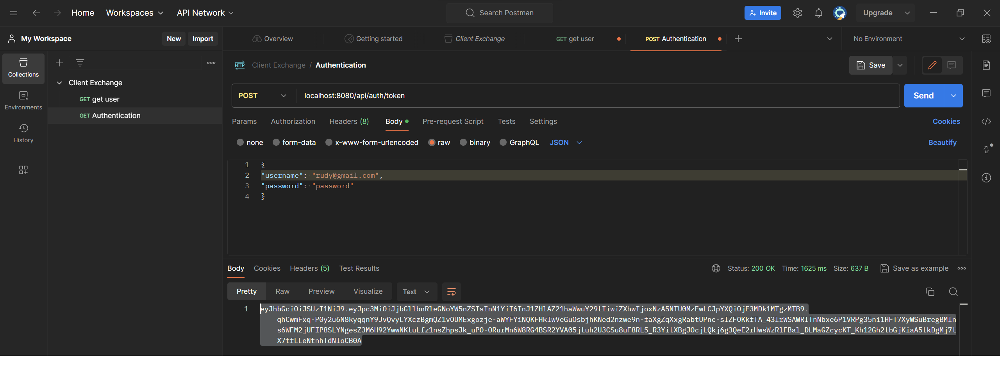

Copy entire outputted JWT Token and enter it into the Authorization -> Bearer Token on your 'get user' request.

Check out the  following website: [jwt.io test](jwt.io)

Can paste in the JWT Token into 'Encoded' to view the algorithm used to generate the token from your get user request.

```npm i``` and ```npm start``` in iceberg-ui to Start and test login on Frontend website

### Landing Page:
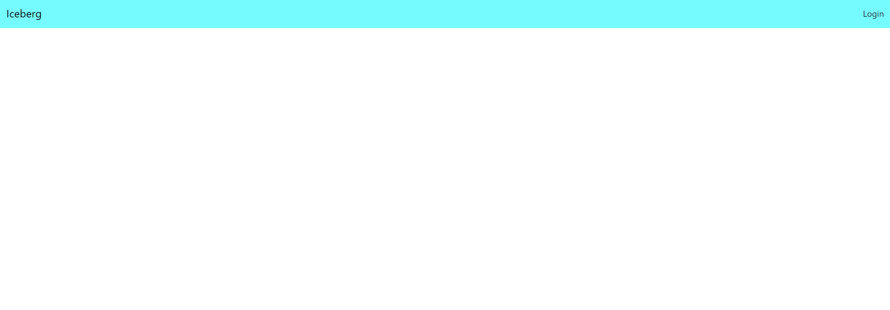

### Login Start:
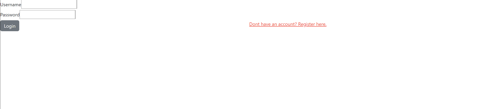


